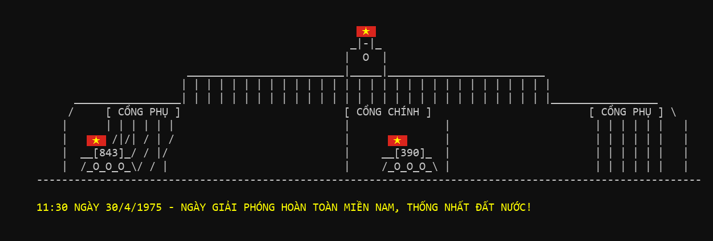

# 🇻🇳 51st Anniversary of National Reunification Day (30/04/1975 - 30/04/2026)

## 📜 Thông điệp / Message

### [VN] Tiếng Việt
"Có những mốc son không bao giờ phai dấu, có những khúc khải hoàn vang vọng mãi với thời gian."

Cách đây đúng 51 năm, tiếng xích xe tăng tiến vào Dinh Độc Lập đã khép lại một chương dài gian khổ nhưng đầy oanh liệt của dân tộc. Ngày 30/04/1975 không chỉ là ngày non sông nối liền một dải, mà còn là biểu tượng của ý chí kiên cường, trí tuệ và tinh thần đoàn kết không gì lay chuyển nổi của người Việt Nam.

Nhìn lại quá khứ để thấy rằng: “Hòa bình hôm nay được đổi bằng xương máu và những khối óc phi thường của cha ông.”

Thế hệ cha ông chúng ta đã "sáng tạo" trong chính mưa bom bão đạn để bảo vệ Tổ quốc. Còn hôm nay, chúng ta đang kế thừa tinh thần ấy bằng những "vũ khí" mới đó là: Khoa học, Công nghệ, Kỹ thuật và Toán học - những giá trị cốt lõi của STEM. Bằng những dòng code, chúng mình muốn gửi gắm đến Đất nước thông điệp đổi mới và sáng tạo trong kỷ nguyên vươn mình, xứng đáng với thế hệ mới!

Chào mừng 51 năm ngày Giải phóng miền Nam, thống nhất đất nước, EPIC - CLB STEM Quốc Học Quy Nhơn sẽ luôn giữ vững ngọn lửa đam mê. Chúng ta hiểu rằng: “Sống trong hòa bình là một đặc ân, và cống hiến cho sự phát triển của quốc gia là một sứ mệnh.”

Không phụ lòng thế hệ đi trước, hãy cùng nhau xây dựng một Việt Nam hùng cường bằng sức mạnh của tri thức và sự sáng tạo không giới hạn!

Chúc mừng ngày lễ trọng đại của dân tộc!

### [EN] English
"There are milestones that never fade, and there are anthems of triumph that echo eternally through time."

Exactly 51 years ago, the sound of tank tracks rolling into the Independence Palace closed a long, arduous, yet profoundly heroic chapter of our nation. April 30, 1975, is not just the day our country was reunited, but also a symbol of the resilient will, intellect, and unshakable solidarity of the Vietnamese people.

Looking back at the past, we realize: "Today's peace was exchanged for the blood, bone, and extraordinary minds of our forefathers."

Our ancestors were "creative" right amidst the hail of bombs and bullets to defend the Fatherland. Today, we inherit that spirit with new "weapons": Science, Technology, Engineering, and Mathematics - the core values of STEM. Through these lines of code, we want to send a message of innovation and creativity to our country in its era of ascendance, worthy of the new generation!

Celebrating the 51st anniversary of the Liberation of the South and National Reunification, EPIC - the STEM Club of Quoc Hoc Quy Nhon High School will always keep the flame of passion burning bright. We understand that: "Living in peace is a privilege, and contributing to the nation's development is a mission."

To not let down the preceding generations, let us together build a mighty Vietnam with the power of knowledge and boundless creativity!

Happy National Reunification Day!

---
*Developed with pride by *EPIC* - STEM Club of Quoc Hoc Quy Nhon.*
